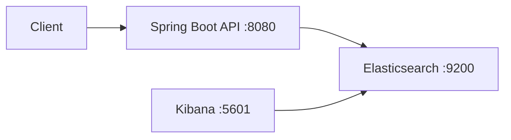

# Elasticsearch Growth POC

Spring Boot proof-of-concept demonstrating Elasticsearch indexing and search for a product catalog and order workflow, with Kibana for visualization.

## Architecture



## Prerequisites

- Java 17+
- Maven 3.9+
- Docker and Docker Compose

## Quick Start

### 1. Start Elasticsearch and Kibana

```bash
docker compose up -d
```

- Elasticsearch: http://localhost:9200
- Kibana: http://localhost:5601

### 2. Run the Spring Boot application

```bash
./mvnw spring-boot:run
```

API base URL: http://localhost:8080

## API Endpoints

| # | Method | Endpoint | Description |
|---|--------|----------|-------------|
| 1 | `POST` | `/api/products` | Create and index a product |
| 2 | `GET` | `/api/products/{id}` | Retrieve a product by ID |
| 3 | `GET` | `/api/products/search?q=&category=` | Full-text search products |
| 4 | `POST` | `/api/orders` | Create an order (validates stock) |
| 5 | `GET` | `/api/orders/search?customerEmail=&status=` | Search orders by customer or status |

### Example: Create a product

```bash
curl -s -X POST http://localhost:8080/api/products \
  -H 'Content-Type: application/json' \
  -d '{
    "name": "Wireless Headphones",
    "description": "Noise cancelling over-ear headphones",
    "category": "electronics",
    "price": 199.99,
    "stock": 25
  }'
```

### Example: Search products

```bash
curl -s "http://localhost:8080/api/products/search?q=headphones&category=electronics"
```

### Example: Create an order

```bash
curl -s -X POST http://localhost:8080/api/orders \
  -H 'Content-Type: application/json' \
  -d '{
    "customerEmail": "buyer@example.com",
    "items": [
      { "productId": "<product-id>", "quantity": 1 }
    ]
  }'
```

### Example: Search orders

```bash
curl -s "http://localhost:8080/api/orders/search?customerEmail=buyer@example.com&status=PENDING"
```

## Kibana

After starting Docker Compose, open Kibana at http://localhost:5601 and create index patterns for `products` and `orders` to explore indexed documents.

## Running Tests

Integration tests use Testcontainers to spin up Elasticsearch automatically:

```bash
./mvnw test
```

When Docker is unavailable, integration tests are skipped and controller unit tests still run.

## Configuration

| Variable | Default | Description |
|----------|---------|-------------|
| `ELASTICSEARCH_URI` | `http://localhost:9200` | Elasticsearch connection URI |
